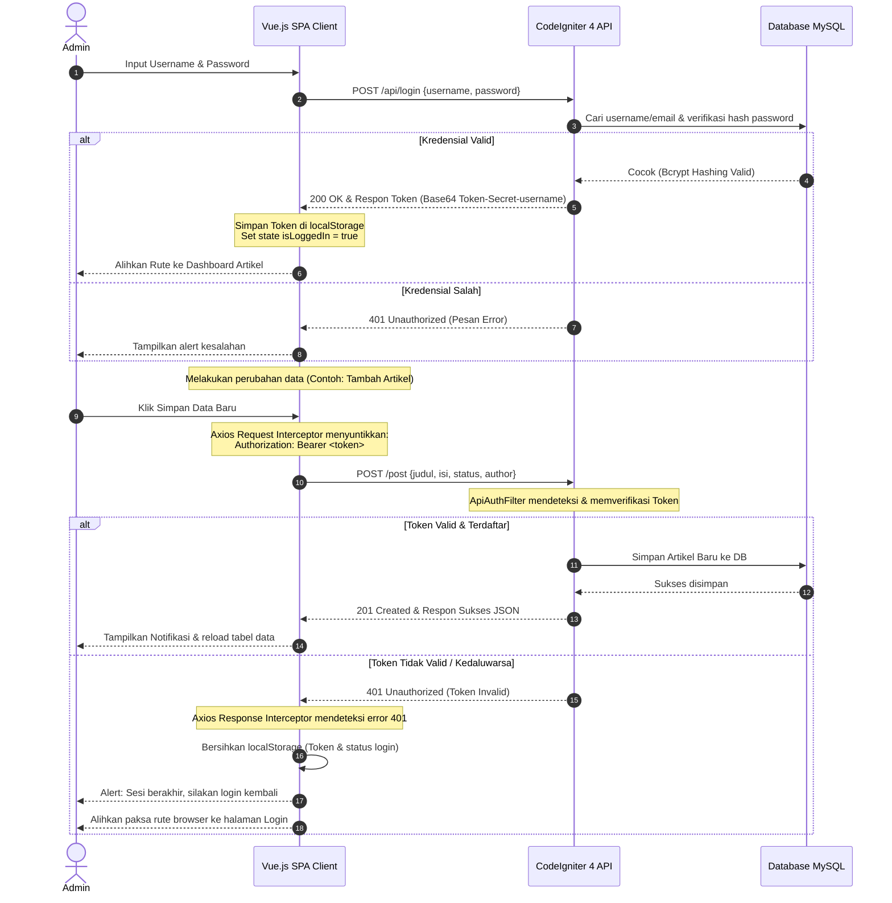
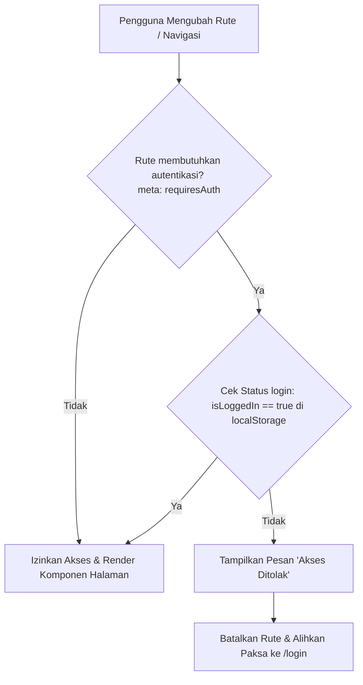

# Laporan Akhir Praktikum Pemrograman Web 2
## Sistem Portal Berita Terintegrasi (CodeIgniter 4 & Vue.js 3 SPA Secured)

---

## 📌 Deskripsi Proyek
Proyek ini merupakan sistem portal berita terintegrasi yang menggabungkan kekuatan **CodeIgniter 4** sebagai RESTful API Backend dan **Vue.js 3** sebagai Single Page Application (SPA) Frontend. 

Arsitektur aplikasi dirancang secara modular dan aman dengan menerapkan pemisahan tugas (*separation of concerns*). Pertukaran data antara klien (SPA) dan server (API) dimediasi menggunakan format JSON dan diamankan menggunakan metode **Token-Based Authentication** yang dilengkapi dengan **Axios Interceptors** serta **Client-Side Navigation Guards**.

---

## 🛠️ Stack Teknologi
- **Backend Framework**: CodeIgniter v4.4.x (PHP 8.2+)
- **Frontend Framework**: Vue.js v3.x (Single Page Application)
- **Routing & State**: Vue Router v4.x & State Terpusat Klien
- **HTTP Client**: Axios (dengan Request/Response Interceptors)
- **Database**: MySQL / MariaDB
- **User Interface**: HTML5, TailwindCSS (Modern Responsive Layout), & FontAwesome v6.4

---

## 💾 Skema Database
Sistem ini menggunakan database relasional dengan dua tabel utama, yaitu `user` (untuk autentikasi) dan `articles` (untuk manajemen konten).

### 1. Tabel: `user`
Tabel ini digunakan untuk mengelola data akun pengguna/administrator yang memiliki hak akses untuk memanipulasi artikel.

| Field | Tipe Data | Atribut | Deskripsi |
| :--- | :--- | :--- | :--- |
| `id` | `INT(11)` | Primary Key, Auto Increment | Identifikasi unik setiap pengguna |
| `username` | `VARCHAR(200)` | Not Null | Nama pengguna untuk login |
| `useremail` | `VARCHAR(200)` | Not Null, Unique | Alamat email unik pengguna |
| `userpassword` | `VARCHAR(200)` | Not Null | Password terenkripsi (Bcrypt) |

### 2. Tabel: `articles`
Tabel ini digunakan untuk mengelola konten artikel berita.

| Field | Tipe Data | Atribut | Deskripsi |
| :--- | :--- | :--- | :--- |
| `id` | `INT(11)` | Primary Key, Auto Increment | Identifikasi unik setiap artikel |
| `judul` | `VARCHAR(200)` | Not Null | Judul utama artikel (min 5 karakter) |
| `slug` | `VARCHAR(200)` | Not Null, Unique | URL-friendly identifier untuk SEO |
| `isi` | `TEXT` | Not Null | Konten utama isi berita (min 10 karakter) |
| `gambar` | `VARCHAR(200)` | Nullable | Nama berkas gambar sampul artikel |
| `status` | `TINYINT(1)` | Default: `0` | Status publikasi (`0`: Draft, `1`: Publish) |
| `author` | `VARCHAR(100)` | Default: `'Admin'` | Nama penulis artikel |
| `created_at` | `DATETIME` | Nullable | Cap waktu pembuatan data |
| `updated_at` | `DATETIME` | Nullable | Cap waktu pembaruan terakhir data |

---

## ⚙️ Fitur-Fitur Utama Aplikasi

### 1. Sistem Upload Gambar Multiformat (Praktikum 6)
- Pengunggahan gambar sampul berita dengan validasi tipe berkas (`jpg`, `jpeg`, `png`, `gif`) dan batasan ukuran maksimal 2MB.
- Penamaan acak otomatis (*randomized filename*) untuk mencegah tabrakan berkas di server.

### 2. Server-Side Rendering (SSR) & Asynchronous Client (Praktikum 8 & 9)
- Manajemen artikel sisi admin yang responsif memanfaatkan **jQuery AJAX**.
- Fitur pencarian (*real-time search*), pagination asinkronus, pengurutan kolom (*dynamic sorting*), dan indikator animasi loading data tanpa melakukan refresh halaman.

### 3. RESTful API Endpoint Architecture (Praktikum 10)
- Menyediakan endpoint API berstandar arsitektur REST (Representational State Transfer) melalui `ResourceController` CodeIgniter 4.
- Penanganan respon terstruktur menggunakan format JSON standar HTTP Status Code.

### 4. Single Page Application (SPA) Klien (Praktikum 11)
- Integrasi Vue.js 3 di dalam folder `public/lab8_vuejs/` untuk memuat data asinkronus menggunakan Axios.

### 5. Client-Side Security & Navigation Guards (Praktikum 13)
- Pemisahan halaman menjadi komponen-komponen terisolasi (`Home.js`, `About.js`, `Login.js`, `Artikel.js`).
- Penerapan **Vue Router Navigation Guards (`beforeEach`)** untuk mencegah pengguna anonim mengakses rute sensitif (`/artikel` dan `/about`).

### 6. Server-Side Security & Axios Interceptors (Praktikum 14)
- **Token Filter API**: Sistem backend memvalidasi token otentikasi di setiap request data modifikasi.
- **Request Interceptor**: Secara otomatis menyuntikkan token dari `localStorage` ke dalam HTTP header `Authorization` secara global.
- **Response Interceptor**: Mencegat respon error `401 Unauthorized` secara terpusat untuk mendeteksi token tidak valid/kedaluwarsa, menghapus session penyimpanan lokal, dan mengarahkan paksa pengguna ke halaman login.

---

## 🌐 Spesifikasi Endpoint REST API

| Method | Endpoint | Fungsi | Proteksi | Header / Body |
| :--- | :--- | :--- | :--- | :--- |
| **POST** | `/api/login` | Autentikasi Pengguna & Pengambilan Token | 🔓 Publik | **Body**: `{username, password}` |
| **GET** | `/post` | Mendapatkan seluruh daftar artikel | 🔓 Publik | - |
| **GET** | `/post/(:num)`| Mendapatkan detail spesifik artikel berdasarkan ID | 🔓 Publik | - |
| **POST** | `/post` | Menambahkan artikel baru | 🔒 Token Filter | **Header**: `Authorization: Bearer <token>`<br>**Body**: `{judul, isi, status, author}` |
| **PUT** | `/post/(:num)`| Mengupdate artikel berdasarkan ID | 🔒 Token Filter | **Header**: `Authorization: Bearer <token>`<br>**Body**: `{judul, isi, status, author}` |
| **DELETE**| `/post/(:num)`| Menghapus artikel berdasarkan ID | 🔒 Token Filter | **Header**: `Authorization: Bearer <token>` |

---

## 🔄 Diagram Alur Kerja (Workflow)

### 1. Alur Keamanan Otentikasi Token (Backend & Frontend)

Diagram berikut menjelaskan bagaimana proses login klien menghasilkan token, serta bagaimana interseptor klien dan filter server bekerjasama melindungi manipulasi data artikel:



### 2. Alur Proteksi Rute Klien (Client-Side Navigation Guards)

Diagram ini mengilustrasikan alur logika Vue Router saat mendeteksi rute tujuan yang memerlukan autentikasi sebelum halaman sempat dirender di browser:



---

## 📁 Struktur Direktori Proyek (File Utama)
```text
ci4/
├── app/
│   ├── Config/
│   │   ├── Filters.php          <-- Pendaftaran filter 'apiauth'
│   │   └── Routes.php           <-- Rute publik, admin, dan API Endpoint
│   ├── Controllers/
│   │   ├── Api/
│   │   │   ├── Auth.php         <-- Controller API Login (Token Generator)
│   │   │   └── Post.php         <-- Controller RESTful Resource Artikel
│   │   ├── Ajax.php             <-- Controller penanganan AJAX internal
│   │   └── Artikel.php          <-- Controller admin artikel
│   ├── Filters/
│   │   ├── ApiAuthFilter.php    <-- Filter pengaman Token-Based API
│   │   └── Auth.php             <-- Filter pengaman Session-Based Admin
│   ├── Models/
│   │   ├── ArtikelModel.php     <-- Model data tabel articles (dan auto-slug)
│   │   └── UserModel.php        <-- Model data tabel user
│   └── Views/
│       ├── ajax/index.php       <-- View manajemen AJAX jQuery
│       └── user/login.php       <-- View login halaman backend
├── public/
│   ├── uploads/artikel/         <-- Folder penyimpanan gambar terupload
│   └── lab8_vuejs/              <-- DIREKTORI UTAMA FRONTEND SPA
│       ├── index.html           <-- Entry point HTML (Tailwind & CDN)
│       └── assets/
│           ├── css/
│           │   └── style.css    <-- Pengaturan font & animasi transisi
│           └── js/
│               ├── app.js       <-- Router, Guard, & Interceptors Axios
│               └── components/
│                   ├── Home.js     <-- Dashboard Beranda
│                   ├── About.js    <-- Profil Pengembang (Terproteksi)
│                   ├── Login.js    <-- Form login interaktif
│                   └── Artikel.js  <-- Dashboard CRUD Artikel (Terproteksi)
└── check_db.php                 <-- Script validasi basis data
```

---

## 🚀 Petunjuk Instalasi & Menjalankan Aplikasi

### 1. Persiapan Database
1. Buat database baru bernama `portal_berita`.
2. Impor struktur tabel dan data awal (jika menggunakan dump SQL) atau jalankan migrasi & seeder.
3. Kredensial database diatur pada file [Database.php](file:///c:/laragon/www/lab11_php_ci/ci4/app/Config/Database.php) (Default: Host=`localhost`, Username=`root`, Password=`""`, Database=`portal_berita`).

### 2. Cara Menjalankan Aplikasi
Karena CodeIgniter 4 membutuhkan **PHP 8.2 atau lebih tinggi**, jalankan aplikasi menggunakan command line development server bawaan PHP 8.4 Anda:

1. Buka PowerShell / Terminal di folder proyek `ci4`:
   ```powershell
   cd c:\laragon\www\lab11_php_ci\ci4
   ```
2. Nyalakan server pembangunan:
   ```powershell
   php spark serve
   ```
3. Buka browser Anda untuk mengakses halaman utama aplikasi:
   - **Frontend SPA (Vue.js)**: [http://localhost:8080/lab8_vuejs/index.html](http://localhost:8080/lab8_vuejs/index.html)
   - **Backend Web (Standard)**: [http://localhost:8080/](http://localhost:8080/)
   - **Login Sesi Web (Standard)**: [http://localhost:8080/user/login](http://localhost:8080/user/login)

---

## 🔒 Uji Coba Kredensial Login
Akun uji coba default yang terdaftar di database:
- **Email**: `admin@email.com`
- **Username**: `admin`
- **Password**: `admin123`

---

**Instansi**: Universitas Pelita Bangsa, Bekasi  
**Dosen Pengampu**: Agung Nugroho, S.Kom., M.Kom.  
**Praktikan**: Arfianda  
